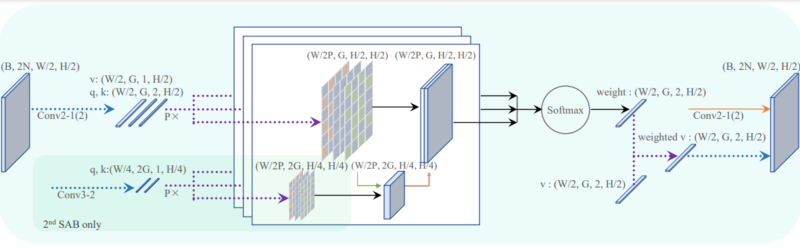

# **Overview**
Official implementation of the paper ``SAB: Smooth Attention Branch for Biomedical Image Segmentation"
<p align="center"></p>
# **Requirements**
+ Python = 3.6
+ Pytorch = 1.10.2
+ Install other packages in requirements.txt

# **Datasets**
```
Smooth-Attention-Branch
├── Train/
│   ├── img/
│   │   ├── train01.png
│   │   ├── train02.png
│   │   ├── train03.png
│   │   ... 
│   └── labelcol/ 
│       ├── train01.png
│       ├── train02.png
│       ├── train03.png
│       ... 
├── Validation/
│   ├── img/
│   │   ├── Validation01.png
│   │   ├── Validation02.png
│   │   ├── Validation03.png
│   │   ... 
│   └── labelcol/ 
│       ├── Validation01.png
│       ├── Validation02.png
│       ├── Validation03.png
│       ... 
```

# **Demo**
You can run a trained model on a sequence of images and visualize the results:

```
$ cd Smooth-Attention-Branch/
$ python demo_run.py
```
